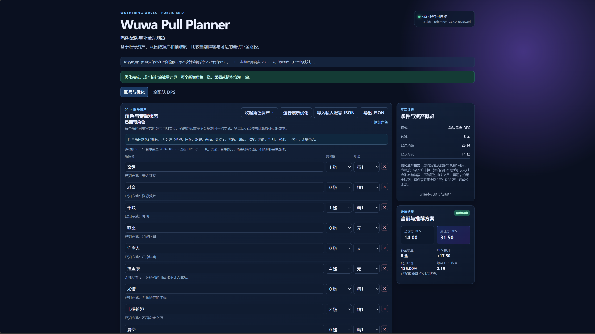
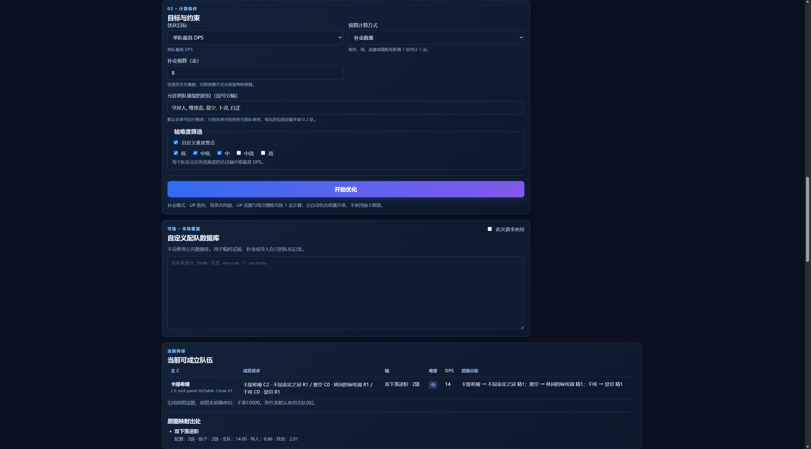
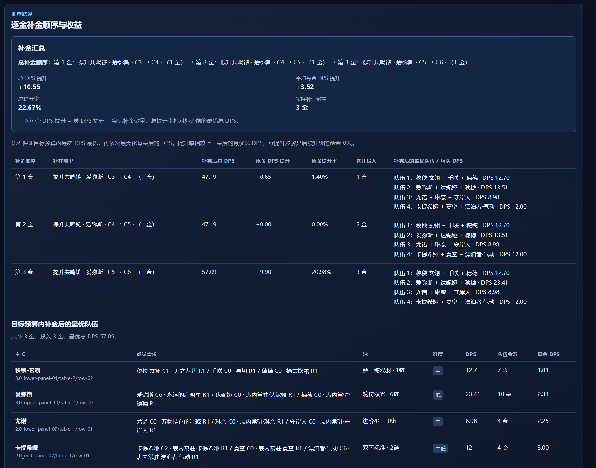
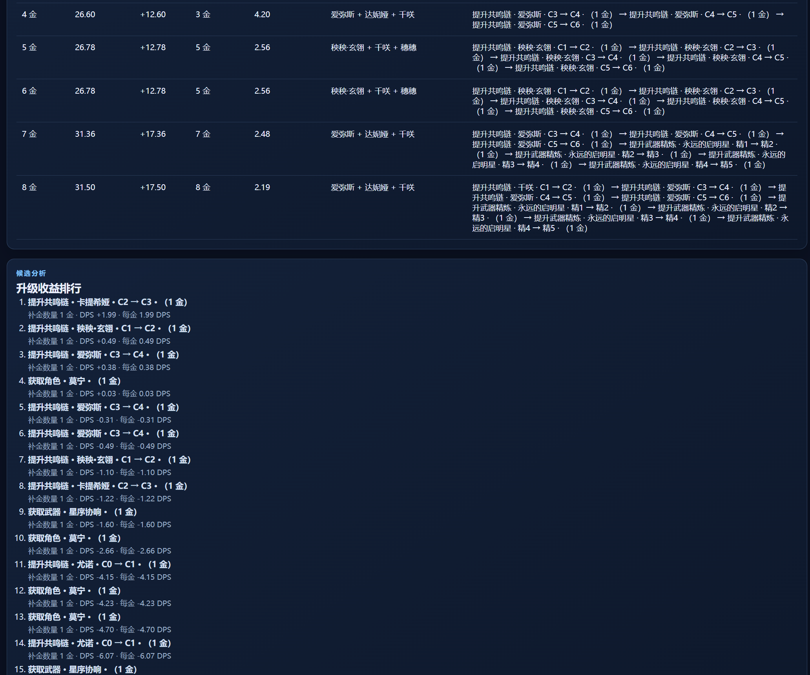

# Wuwa Pull Planner

**鸣潮配队与补金规划器** · A Wuthering Waves team DPS and pull-budget optimizer.

GitHub: https://github.com/DreamAutumn-space/wuwa-pull-planner

可运行 V1：独立 Python 核心库 + FastAPI + Vue 3 / TypeScript / Vite + Docker Compose。匿名使用，公共 DPS 文件与浏览器中的个人库存分开。

**优化器默认使用 V3.5.2 原图的已映射参考数据。** 角色资产纯手动录入，角色卡片识别及上传接口已删除。50张配置卡、150个头像槽和65张表的824行原文长期留存；其中64张表、811个有效端点已进入计算库，绯雪7处配队已更正。原图缺失数据不插值，缺难度的表暂不参与计算。高配行累计继承，未标精炼的“专”按精1；演示库单独保留供验证算法。

## 使用展示

以下截图展示从角色资产录入、计算条件设置到补金建议的使用流程。图中账号配置与计算结果为展示示例，实际结果取决于输入资产、预算和配队数据库。

### 1. 角色资产与结果概览

手动维护角色、共鸣链与专武状态，查看当前 DPS、推荐 DPS 和补金收益。



### 2. 计算条件与当前队伍

选择优化目标、预算计算方式、奶位白名单和轴难度，支持按期望抽数或补金数量进行计算。



### 3. 推荐队伍与补金路径

展示预算内的最优队伍、逐步升级路径、原图映射出处和 Pareto 前沿。



### 4. 各预算对照与升级收益排行

比较不同金数预算下的推荐队伍、实际使用金数和每金 DPS 收益，并查看升级收益排行。



## 本地运行（Windows PowerShell）

在项目根目录执行：

```powershell
python -m venv .venv
.\.venv\Scripts\python.exe -m pip install -r requirements-dev.txt
.\.venv\Scripts\python.exe -m pytest
```

先启动后端，保持此终端运行：

```powershell
.\.venv\Scripts\python.exe -m uvicorn app.main:app --app-dir backend --host 127.0.0.1 --port 8000
```

再打开另一个终端进入前端目录：

```powershell
cd frontend
```

首次运行或依赖变更时，单独安装依赖：

```powershell
npm.cmd ci
```

安装前请先停止本项目已运行的 Vite 服务（在对应终端按 `Ctrl+C`）。Windows 会锁住运行中的 `esbuild.exe`，此时执行 `npm ci` 会报 `EPERM`，并可能留下不完整依赖。停止服务后重新执行 `npm.cmd ci` 即可恢复。

依赖安装成功后启动前端；后续日常启动只需执行这一条：

```powershell
npm.cmd run dev -- --host 127.0.0.1
```

访问 `http://127.0.0.1:5173`。API 文档为 `http://127.0.0.1:8000/docs`。前端通过同源 `/api` 代理请求后端。

## 不启动 Web，直接计算 JSON

```powershell
.\.venv\Scripts\python.exe scripts/optimize.py --request data/demo-request.json --database data/demo-dps.json --output outputs/demo-result.json
.\.venv\Scripts\python.exe scripts/optimize.py --request data/reference-request.json --output outputs/reference-result.json
```

库独立调用：

```python
from wuwa_optimizer import apply_default_four_stars, expand_character_account, optimize
from wuwa_optimizer.reference_adapter import prepare_reference_inputs
# 使用角色正式姓名；signature_catalog 是角色名到专武名的映射。
assets = expand_character_account(apply_default_four_stars(account), signature_catalog)
assets, dps_database = prepare_reference_inputs(assets, dps_database, assume_common_weapons=True)
result = optimize(assets, dps_database, settings)
```

示例输入见 `data/demo-request.json` 和 `data/demo-dps.json`。示例主 C 一链的中难轴 DPS 不变，二链才提升；162.30 期望抽预算仍应选出二链路径，用于验证过路金不会被错误剪枝。网页使用 `data/demo-character-request.json` 的简化格式；同一奶位跨队需要额外专武，因此网页演示预算包含这部分成本。

## 操作流程

1. 手录 / 导入角色，或独立体验算法演示。演示请求不替换浏览器账号和偏好。名称输入从目录单选；支持部分姓名和别名查找，例如“千”匹配千咲、“玄翎”匹配秧秧·玄翎。
2. 每行只填写角色、共鸣链和专武“无 / 精1 / 精5”，无须编辑独立武器列表。旧存档精2–4会保留。非零精炼按持有一把该角色专武处理，后端根据公共专武目录生成计算资产。
   12名四星默认已拥有且6链，不在已拥有角色中罗列。五星与主角的既有手动输入不被覆盖；提交时仅对精确别名归一化。
3. 选择一队、两队、四队、指定主 C 或固定三人队，设置预算、难度和奶位白名单。
4. 确认库存准确后计算。自定义 DPS JSON 可以在页面修正，仅用于本次请求。
5. 在“全配队 DPS”页面完整查看原始 V3.5.2 图和65张已转录表格，支持高清放大、原始尺寸和版本分区导航。数值、备注、难度、稳定性、作者和口径说明保留；页面显示已接入计算的覆盖和排除项。
6. 使用结构化数据计算当前队伍、预算内最高总 DPS、投入路径、累计收益和 Pareto 前沿。当前不足完整队数时，没有可比较的完整基准，百分比提升显示为不可用。

个人库存与偏好保存在当前浏览器 localStorage，可清除或导出；没有注册登录或个人账号云端保存。公共文件从服务器只读加载，自定义数据不能修改其他人的数据库。

简化账号 JSON 示例：

```json
{"characters": [{"character": "今汐", "chain": 0, "signature_refinement": 1}]}
```

`signature_refinement=0` 表示“无专武”选择。缺少精确专武映射时不会臆造名字。常驻、四星与漂泊者的推荐通用武器不冒充限定专武。图中只看得到当前装备，未装备专武仍可在页面自行改选。旧版包含 `weapons` 的 JSON 仍由核心库与 API 支持；新版界面导入旧版时不会擅自将通用武器匹配成专武，会提示人工核对。

完整 DPS 原图在 `data/public/reference-dps.jpg`，不包含个人账号图。角色目录在 `data/signature-weapons.json`，已核对至2026-10-06、3.7版本，包含所有已公布限定五星、常驻五星、主角形态及四星策略；本期UP信息只供查阅，不限制抽卡候选。没有角色图片上传或识别入口。

## 长期头像资料库与 DPS 重识别

用户提供的四张带姓名截图已裁为56张独立无损PNG，长期保存在 `data/portraits/`。`data/portrait-atlas.json` 提供姓名、别名、源位置及文件索引；头像明暗不表示账号持有状态。玩家自定义昵称不纳入公共角色名。

`scripts/extract_portraits.py` 接受四个源图片参数，可复现这套网格的提取；更换截图版式或角色顺序时必须调整网格与姓名映射。

离线重识别需要额外依赖，普通Web运行不依赖OCR引擎：

```powershell
.\.venv\Scripts\python.exe -m pip install -r requirements-ocr.txt
.\.venv\Scripts\python.exe scripts/reparse_dps.py
```

结果在 `data/dps-recognition-v3.5.2.json`，交付副本在 `outputs/`，网页“全配队DPS”页默认展示完整已核对表格，自动OCR原文单独折叠。`data/dps-review-v3.5.2.json` 保存全部50卡头像和65表的视觉校对，按原图哈希绑定；重跑OCR自动重新应用，避免绯雪等角色再次被错认。`data/dps-transcription-v3.5.2.json` 是独立的原文转录资料，保留全队、单人、效应、不同层数等列，不能当作优化器格式导入。

页面支持按角色槽进行本地修正、保存、撤销与导出，不改动账号资产及公共文件。漂泊者各形态的头像外观不能作为形态判定依据，依表内光主/雷主等原文记录。将导出的校对记录永久合并到项目时执行：

```powershell
.\.venv\Scripts\python.exe scripts/apply_dps_reviews.py --merge-review <导出的校对JSON路径> --save-review
.\.venv\Scripts\python.exe scripts/export_dps_transcription.py
```

可选的 `scripts/extract_dps_cells.py` 测量65张表的真实格线并关联已有OCR文字；默认不再次识别单元格。需要逐格OCR时显式加 `--ocr-cells`，其输出仍是待审候选。

配置转换为 `data/reference-dps-v3.5.2.json`，逐行配置解释留存于 `data/dps-configuration-mapping-v3.5.2.json`。重建计算库：

```powershell
.\.venv\Scripts\python.exe scripts/build_reference_database.py
```

原图未明确写出单位，保留13.02、5.82等原始读数，不擅自乘以10000。效应和单人列不加到全队数值中；条件表采用“全队0层”，不默认获取1层/2层效果。原图真实下降、零提升和缺失行不改写。`2.0_lower-panel-05/table-1` 无难度，暂不参与计算；星号行不插值。`全01` 表的后续“专”按用户精1规则不能形成新的累计配置，相关行保留原文而不生成不同DPS端点。全部排除原因见计算库 metadata。

简化资产模式下，图中常驻精1基线装备默认每队可配备，分配仍使用独立实例；具体名称未说明的装备记录为“表内常驻·角色名”，不会冒充专武。这里是明确的装备可用假设，不是识别到的个人库存。旧版显式 `weapons` JSON 不添加这些基线装备。原图裸“5精”首次指主C，重复时沿最近角色升级解释，逐行操作可在映射文件中审查。漂泊者不同形态只有用户明确录入且达到表内链数需求时参与计算，不将解锁形态或链数按抽卡成本补足。

## 算法与边界

- 单队最大化 DPS；两队 / 四队最大化同时成立的队伍总 DPS。要求完整的 2 / 4 队，凑不齐时返回不可行，不会冒充完整组合。
- 非白名单角色每组最多出现一次；白名单默认包含守岸人、维里奈、莫宁、卜灵、白芷、穗穗，可由玩家修改。每名白名单奶位固定最多参与两队，对应矩阵的两点体力；兼容旧 JSON 的容量字段，但求解时统一按 2 队处理。旧版未修改的默认名单会自动补上穗穗，已有自定义名单保持原值。
- 每个队员必须分配独立实体武器，奶位重复也不能复用武器。联合匹配已持有的不同精炼武器，再计算需要购买的新武器或追加精炼。
- 低 < 中低 < 中 < 中高 < 高。自定义难度集合覆盖最高难度；每条配置记录在合法轴中取最大 DPS。
- 未拥有角色到零链需一金，零链到二链需两金；未拥有武器到精一需一金，到精三需三金。已有资产仅计算差额。
- 支持两种预算：`settings.cost_mode="pulls"`（默认）按期望抽数，角色 / 共鸣链 81.15 抽、武器 / 精炼 54.11 抽；`"gold"` 按补金数量，每次新增角色、共鸣链、武器或精炼均计 1 金，不考虑抽卡期望。`settings.budget` 在金数模式必须为非负整数；已有资产不重复计成本，精1升精5需补4金。内部仍使用整数进行准确比较。
- 指定主 C（`mode="main_c"` / `target_main_c`）要求该角色为主 C；指定角色队伍（`mode="character"` / `target_character`）筛选包含该角色的单队，允许该角色出现在辅助或奶位；固定队伍（`mode="fixed_team"` / `target_team`）保持三名成员不变。三者均支持抽数和金数预算。
- 响应 `cost_mode` 标明成本单位，方案与每步操作的 `cost` 使用相同单位。金数模式展示每金 DPS 收益 `roi_per_gold`，抽数模式沿用 `roi_per_100_pulls`。金数对照从同一次精确搜索的 Pareto 前沿中选取各预算下的最优方案，无需重复请求。
- 精确搜索满足目标的配置组合，按预算下界、角色冲突和DPS上界进行安全剪枝，再计算最小资源成本。不是按下一金 ROI 贪心搜索，路径包含所有中间前置金。升级顺序只是可行的投入说明，不保证每个前缀都独立最优。
- **“精确”只针对输入数据库和此资源模型。** 未列出的角色、武器和配置不会凭空估计 DPS；不限制当前卡池，但需要数据才能给出收益结论。
- 记录中的链数 / 精炼默认视为最低配置要求，不插值。成员可额外设置 `max_chain`（默认6），当升级改变轴或降低表现时，把不适用的高链排除。已有角色不能降链；跨队重复奶位也必须同时满足所有队伍的上下限。例如上限5链的轴不能用于已有6链账号。未明确标记链数上限或精炼变化的记录仍需验证其适用范围。
- V1 不将现有独立武器相互合并精炼，只为每次追加精炼计一把新抽取武器。这样避免偷偷消耗另一个队的武器；旧库存融合可另做可显式确认的扩展。
- 搜索超过服务端组合限额或运行时限会明确报错，不会把未完成结果标成全局最优。大数据四队搜索仍需后续专门做性能优化和负载测试。

完整的金数请求示例见 `data/reference-gold-request.json`：在 3 金预算内优化包含今汐的队伍。网页可切换预算方式，抽数预算与金数预算分别保存，结果按本次请求的实际单位显示。

## 数据与固定模板

公共计算库默认 `data/reference-dps-v3.5.2.json`，可通过 `WUWA_DATABASE_FILE` 设置数据目录下的另一个JSON文件名。演示库 `data/demo-dps.json` 通过独立接口 `/api/demo-database` 和演示请求加载。单条记录包含三名队员链数、武器精炼需求、主C和难度轴；source 字段保留原表与原行出处。

参考图分区与历史模板说明见 `docs/fixed-template-parsing.md`。当前账号完全由用户手动维护；DPS识别仅作为离线资料处理和待校对展示。

## Docker Compose

需要安装并启动 Docker Desktop，或在 Linux 服务器上安装 Docker Engine / Compose。

```powershell
docker compose up --build -d
```

访问 `http://localhost:8080`；可用 `.env` 设置 `WEB_PORT`。前端容器提供网页并将 `/api` 转发到后端，后端不直接暴露公网端口。

该配置是匿名多人服务的部署骨架。正式开放前需在域名入口配置 HTTPS，并针对目标人数进行负载测试；当前实现已有请求体和搜索限额、计算并发限制、清晰的繁忙 / 超时响应。服务器不保存用户库存或上传原图。进程内并发限制不是跨实例的全局队列。大预算四队超过搜索或时限时会明确报错，不能将未完成搜索当成精确结果。

## 项目结构

```text
core/                 可单独安装的 Python 库与算法测试
backend/              FastAPI API、公共资料接口与 API 测试
frontend/             Vue 3 / TypeScript 界面、Vite 和 Nginx
data/                 公共演示 DPS、示例请求、固定模板描述
docs/                 解析流程与已核实版式
scripts/optimize.py    JSON 命令行入口
docker-compose.yml    前后端部署
```

前端生产构建检查：`cd frontend; npm.cmd run build`。后端与算法检查：在根目录运行 `.venv\Scripts\python.exe -m pytest`。

## License

项目原创代码采用 MIT License，允许使用、修改、分发和商用，需保留版权及许可证声明。第三方角色美术、游戏截图、DPS 原图及其转录数据的权利不由此许可证授予，来源和范围见 `NOTICE.md`。
